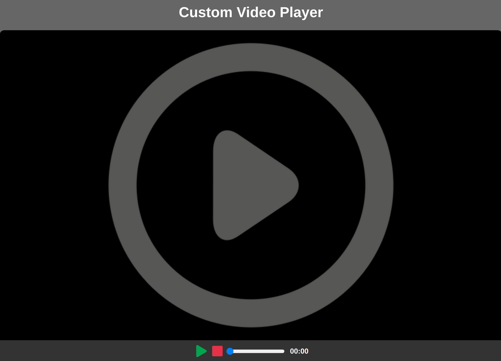

# custom-video-player

Mini custom video player, using vanilla JavaScript

### Functions:

[The app](https://tn-space.github.io/custom-video-player/)

The app has many functions of a typical video player:

- to play
- to pause
- to stop
- to set progress on the progress bar
- time update as the video plays

### Images:

